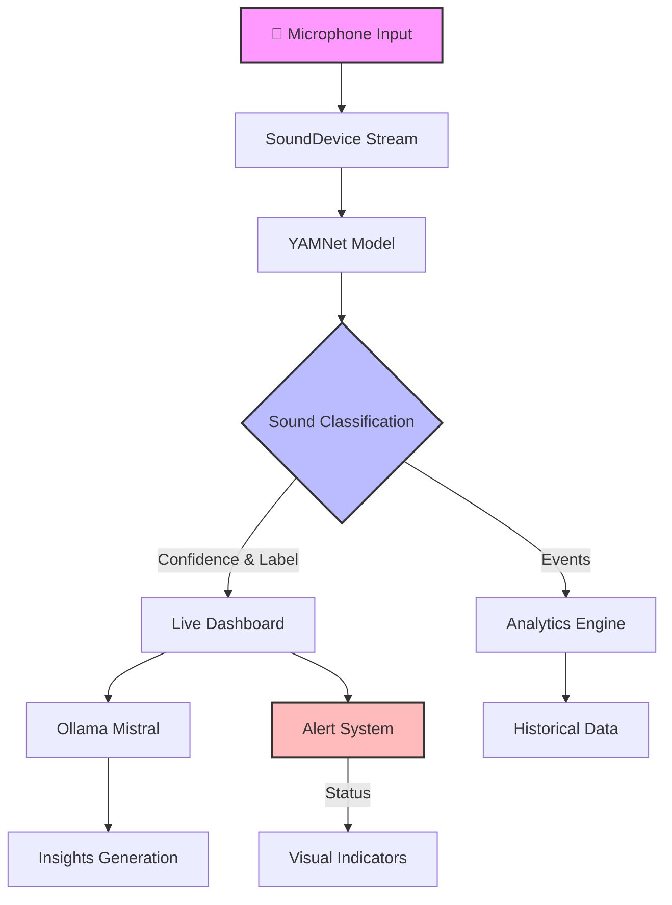

# 🎧 Low-Latency Sou## 🚨 Use Case Example: Police Siren Detection

<div align="center">

### Without Sound Disambiguator

*A deaf person unable to hear approaching emergency vehicle sirens*

### With Sound Disambiguator
guator

> Real-Time Audio Intelligence Dashboard for Sound Awareness

[](https://github.com/rohitsagar363/Low-latency-Sound-Disambiguator)
[](https://github.com/rohitsagar363/Low-latency-Sound-Disambiguator)

## 🧩 Overview

The **Low-Latency Sound Disambiguator** is an innovative real-time audio intelligence system designed to enhance accessibility and sound awareness. This project:

- 🎯 Listens to live microphone input continuously
- 🤖 Utilizes Google's **YAMNet** for precise sound detection
- 🧠 Leverages **Ollama (Mistral)** for intelligent sound interpretation
- 📊 Provides instant visual feedback through an intuitive dashboard

### Core Use Case

> Empowering deaf and hearing-impaired individuals by transforming critical sounds (alarms, sirens, shouts) into clear, real-time visual alerts, enhancing safety and environmental awareness.

## � Use Case Example: Police Siren Detection

<div align="center">

### Without Sound Disambiguator

*A deaf person unable to hear approaching emergency vehicle sirens*

### With Sound Disambiguator

*Real-time visual alert showing:*
- 🚓 **Detection**: Police siren detected
- 📍 **Direction**: Coming from behind, ~100m away
- 🔊 **Intensity**: High (Emergency vehicle approaching)
- ⚠️ **Action Required**: Move to the side of the road

</div>

> **Note**: Create an `images` directory and add relevant screenshots or mockups of your system in action. The images above are placeholders - replace them with actual screenshots from your application showing the alert system responding to police sirens.

## �🚀 Key Features

| Feature | Description |
|---------|-------------|
| 🔍 Real-time Classification | Advanced sound detection using YAMNet (TensorFlow Hub) |
| ⚡ Low-latency Processing | Efficient streaming with SoundDevice + async queue |
| 🤖 AI Insights | Smart context interpretation via Ollama (Mistral) |
| 📡 Direction Detection | Intelligent stereo microphone utilization with fallback simulation |
| 🚦 Visual Alerts | Smart color-coding system: 🟢 Safe • 🟡 Neutral • 🔴 Alert |
| 📊 Rich Dashboard | Comprehensive view with Live/History/Analytics/Insights tabs |
| 💨 Lightweight Design | Quick local deployment with minimal resource usage |  

## 📊 Dashboard Interface

### 🎯 Live Tab

*Real-time monitoring and detection interface*
- Sound classification with confidence levels
- Direction indicator with spatial awareness
- Color-coded alert banner system
- Live AI interpretations of detected sounds

### 📜 History Tab

*Historical data and event tracking*
- Chronological log of detected sounds
- Time-stamped events with classifications
- Filter and search functionality
- Export capabilities for analysis

### 📈 Analytics Tab

*Statistical analysis and insights*
- Sound type distribution charts
- Temporal pattern analysis
- Alert frequency statistics
- Performance metrics visualization

### 🧠 Insights Tab

*AI-powered interpretation and recommendations*
- Contextual sound interpretations
- Pattern recognition summaries
- Environmental safety scoring
- Actionable safety recommendations

> **📸 Screenshots:** Place your application screenshots in `/images/`:
> - `live_tab.png` - Main monitoring interface
> - `history_tab.png` - Historical data view
> - `analytics_tab.png` - Statistical analysis view
> - `insights_tab.png` - AI interpretation view
> - `before_siren.png` - Use case without system
> - `with_siren.png` - Use case with system active

---

## 🏗️ System Architecture



## 🧰 Technology Stack

| Layer | Components | Description |
|-------|------------|-------------|
| 🎨 Frontend | Streamlit, Plotly | Interactive dashboard with real-time updates |
| 🎵 Audio | SoundDevice, NumPy | High-performance audio stream processing |
| 🤖 ML/AI | TensorFlow Hub, YAMNet | Sound classification and analysis |
| 🧠 Intelligence | Ollama (Mistral) | Local LLM for context interpretation |
| 🔄 Processing | Threading, Queue | Concurrent operation handling |
| 📊 Visualization | Plotly, Custom CSS | Dynamic charts and alert banners |

## ⚙️ Installation & Setup

### 1. Clone the Repository

```bash
git clone https://github.com/rohitsagar363/Low-latency-Sound-Disambiguator.git
cd Low-latency-Sound-Disambiguator
```

### 2. Set Up Python Environment

```bash
# Create virtual environment
python3 -m venv venv

# Activate virtual environment
# For Unix/macOS:
source venv/bin/activate
# For Windows:
# venv\Scripts\activate
```

### 3. Install Dependencies

```bash
pip install -r requirements.txt
```

#### Required Packages
```plaintext
streamlit>=1.24.0
tensorflow>=2.12.0
tensorflow_hub>=0.14.0
sounddevice>=0.4.6
numpy>=1.23.5
plotly>=5.15.0
requests>=2.31.0
pandas>=2.0.3
```

### 4. Configure Ollama

1. Download Ollama from [ollama.ai](https://ollama.ai)
2. Start the Ollama service:
```bash
# Pull the Mistral model
ollama pull mistral

# Start the Ollama service
ollama serve
```

### 5. Launch the Dashboard

```bash
streamlit run sound_alert_appv3.py
```

> 🎤 **Note:** Grant microphone access when prompted by your system.
🔊 Grant microphone access when prompted.

## 🧠 System Operation

### Real-time Processing Pipeline

1. **Audio Capture**
   - Continuous streaming in 1.5-second chunks
   - Overlapping segments for smooth analysis
   - Real-time buffer management

2. **Sound Classification**
   - YAMNet model processes each chunk
   - Identifies sound categories and confidence levels
   - Low-latency inference optimization

3. **AI Interpretation**
   - Ollama (Mistral) analyzes classification results
   - Generates contextual two-line summaries
   - Provides human-readable insights

4. **Spatial Analysis**
   - Stereo microphone direction estimation
   - Fallback to simulated positioning
   - Real-time location tracking

5. **Visual Feedback**
   - Dynamic dashboard updates across all tabs
   - Color-coded alert system
   - Historical data tracking and visualization

## 📝 Contributing

Contributions are welcome! Please feel free to submit a Pull Request. For major changes, please open an issue first to discuss what you would like to change.

## 📄 License

This project is licensed under the MIT License - see the [LICENSE](LICENSE) file for details.

## 👥 Team

- **Rohit Sagar** - _Initial work_ - [rohitsagar363](https://github.com/rohitsagar363)

---
<div align="center">
Made with ❤️ for the AI Accessibility Hackathon
</div>

📸 Output Screenshots
🟢 Safe Detection Example

🔴 Alert Detection Example

🧠 AI Insight Summary View

🧩 Demo Flow
Launch the Streamlit app.

Click Start Listening.

Play sounds (e.g., music, speech, alarm) or use your voice.

Watch the live updates, AI summaries, and alert banners appear instantly.

🧭 Future Scope & Enhancements
Area	Next Steps
🔔 IoT Integration	Deploy on Raspberry Pi / ESP32 for edge detection and visual beacons.
🧠 LLM Summarization	Integrate Gemini or GPT-5 for emotion / urgency analysis of sound context.
📡 Multi-Mic Localization	Triangulate sound source direction with a 3-mic array.
🌐 Cloud Dashboard	Push events to Firebase / MQTT for remote monitoring and alerts.
📱 Mobile App Companion	Send push notifications for critical sound events.
🎨 Accessibility Design	Add vibration / haptic feedback and color-blind themes.
🔒 Data Privacy	Fully on-device inference — no audio data leaves the system.
🧾 Analytics Layer	Generate daily summaries and sound frequency heatmaps.

👨‍💻 Team
Team: Udta Buffalo 🦬
Member	Role
Rohith Sagar Karnala	System Architecture, Streamlit Dashboard, ML Integration
Bhargav	Backend Logic, Audio Processing, Model Integration
Amal	Frontend Design, Visualization, Accessibility Enhancements
Manogna	AI Summarization, Testing, Hackathon Presentation

🏁 Hackathon Demo Highlights
Show real-time sound detection and floating alert banners.

Demonstrate AI-generated summaries from Mistral.

Explain the impact for accessibility and deaf users.

Conclude with your Future Scope roadmap — Edge AI + IoT + LLMs.

🧠 Acknowledgments
Special thanks to:

Google TensorFlow Hub for YAMNet.

Ollama & Mistral for local LLM inference.

Streamlit for rapid dashboard development.

🏁 Summary
🎯 Low-Latency Sound Disambiguator represents an accessible, intelligent, and privacy-respecting approach to real-time audio awareness.
It’s lightweight, responsive, and extendable — bridging AI, accessibility, and edge computing into one unified platform.


## 🚀 Project Overview  
The **Low-Latency Sound Disambiguator** is a **real-time AI-powered sound awareness dashboard** designed to help **deaf and hearing-impaired users**.  
It detects, classifies, and interprets sounds instantly using:  
- **Google’s YAMNet (TensorFlow Hub)** for sound classification.  
- **Ollama (Mistral LLM)** for AI-based contextual summaries.  
- **Streamlit** for dynamic visualization and alert banners.

**🏆 Hackathon Track:** AI for Accessibility / Edge Intelligence  
**🎯 Goal:** Convert environmental sounds into intelligent visual alerts for rapid human response.

---

## ⚙️ System Architecture
```mermaid
graph TD
A[🎤 Microphone Input] --> B[SoundDevice Stream]
B --> C[YAMNet Classifier (TFHub)]
C --> D{Detected Sound Label}
D -->|Confidence| E[Streamlit Live Dashboard]
E --> F[Ollama (Mistral) Contextual AI]
F --> G[🧠 Insights & Alerts]
E --> H[📊 History + Analytics Tabs]
G --> I[🔴 Floating Alert Banner]
💡 Key Features
⚡ Ultra-low latency detection pipeline (1.5s sliding window).

🧩 AI-driven contextual summaries for every detected sound.

🟢🟡🔴 Color-coded alerts: Safe / Neutral / Emergency.

🎧 Stereo microphone support for true directional awareness.

📈 Live analytics dashboard showing confidence, direction, amplitude.

💻 Completely local inference — private and offline.

🖥️ Dashboard Interface
🔴 Real-Time Detection

🧠 AI Summaries & Context

🟢 Normal Operation

🧰 Technology Stack
Category	Tool
ML Model	TensorFlow Hub – YAMNet
AI Reasoning	Ollama (Mistral LLM)
Dashboard	Streamlit, Plotly
Audio Ingestion	SoundDevice, NumPy
Processing	Threading + Async Queues
Deployment	Python 3.11, Localhost

⚡ Setup Guide
bash
Copy code
# Clone & Setup
git clone https://github.com/<your-handle>/Low-latency-Sound-Disambiguator.git
cd Low-latency-Sound-Disambiguator
pip install -r requirements.txt

# Start Ollama
ollama pull mistral
ollama serve

# Run App
streamlit run sound_alert_appv3.py
🧩 Demonstration Flow
Start listening via the Streamlit UI.

Generate sounds (music, alarms, voices).

Observe instant classification, AI insight, and floating alert banner.

Review detection history and analytics trends.

📡 Future Enhancements
Area	Next Step
🔔 IoT Integration	Deploy on Raspberry Pi for edge alerts.
📱 Mobile Companion	Push notifications for critical events.
🎙️ Multi-Mic Array	Triangulate true sound direction.
🧠 Emotion Detection	Use LLMs to assess urgency and tone.
🌐 Cloud Extension	Real-time alert dashboard with MQTT.
💬 Haptic Feedback	Wearable integration for vibration alerts.

👨‍💻 Team: Udta Buffalo 🦬
Member
Rohith Sagar Karnala	
Bhargav
Amal
Manogna

🏁 Hackathon Highlights
⚙️ Fully functional end-to-end local demo.

💡 AI-generated live summaries and context.

📊 Real-time dashboard with analytics and insights.

🌍 Accessibility-focused impact for deaf users.

🧠 Impact
The Low-Latency Sound Disambiguator demonstrates how AI and accessibility can merge to improve everyday safety and awareness — empowering those with hearing impairments through instant, intelligent, and interpretable sound recognition.

🏆 Acknowledgments
Google TensorFlow Hub – YAMNet model.

Ollama (Mistral) – local LLM context generation.

Streamlit – dashboard framework.

University at Buffalo Hackathon Team – Udta Buffalo 🦬
